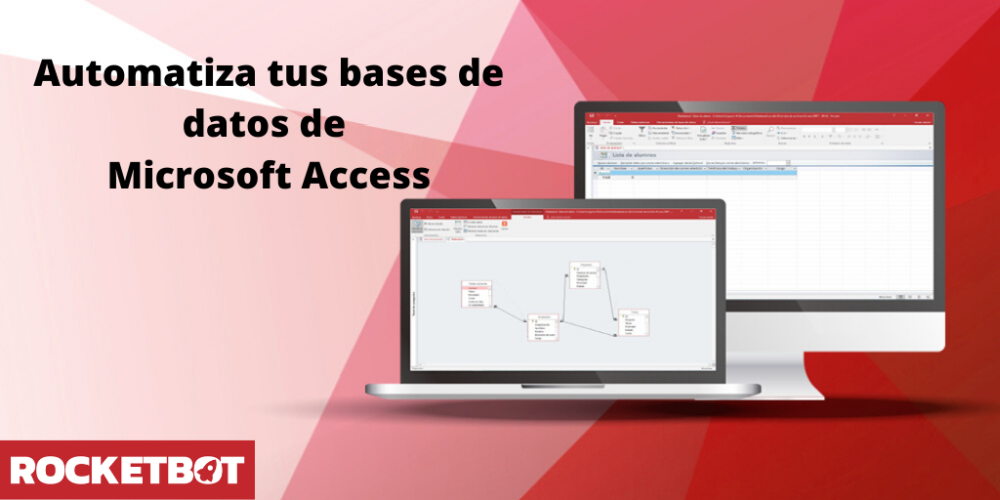

# Microsoft Access
  
Automate Microsoft Access  
  

## Como instalar este módulo
  
__Descarga__ e __instala__ el contenido en la carpeta 'modules' en la ruta de rocketbot.  

## Como usar este módulo

Para usar este módulo, tienes que seleccionar una base de datos (.mdb o .accdb) y 
connectarte a ella; luego puedes ejecutar query para obtener los datos de la misma.

## Descripción de los comandos

### Conectarse a Base de Datos
  
Comando para conectarse a una base de datos desde un archivo access
|Parámetros|Descripción|ejemplo|
| --- | --- | --- |
|Seleccione base de datos|Conecta a la base de datos creada anteriormente. Formatos .mdb y .accdb son aceptados.|C:\Ruta\a\basededatos.accdb|

### Ejecutar query
  
Ejecuta query en una base de datos
|Parámetros|Descripción|ejemplo|
| --- | --- | --- |
|Query|Query que se desea ejecutar en la base de datos.|select * from tabla|
|Asignar resultado a variable|Variable donde guardar el resultado.|Variable|
